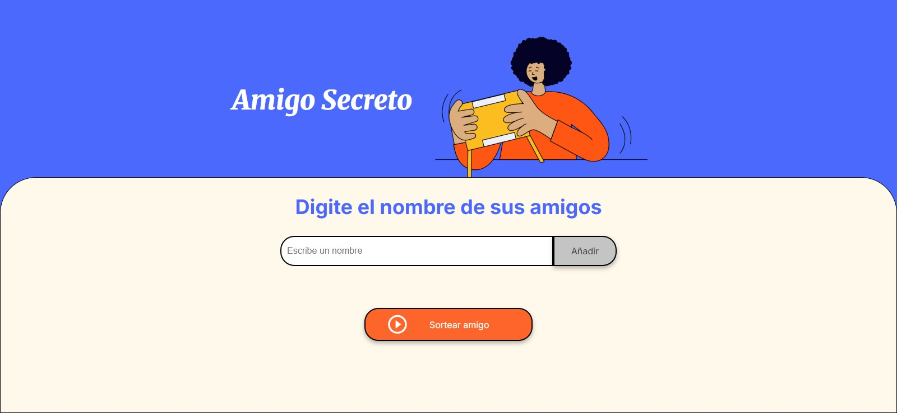

# 🪄 Juego del Amigo Secreto

  
  
  

Un proyecto simple y divertido hecho con **JavaScript**, **HTML** y **CSS**.  
Con este mini-juego podrás:

- ➕ Agregar amigos a una lista.  
- 🚫 Evitar duplicados o nombres vacíos.  
- 👀 Visualizar la lista en pantalla en tiempo real.  
- 🎲 Sortear aleatoriamente un *amigo secreto*.  

---

## 📝 Cómo funciona

1. Escribe un nombre en el cuadro de texto.  
2. Haz clic en **Agregar** para sumarlo a la lista.  
3. Cuando tengas al menos un amigo, presiona **Sortear**.  
4. El resultado aparecerá en pantalla ✨.  

---

## 📂 Archivos principales

- `index.html` → Estructura de la aplicación.  
- `style.css` → Estilos básicos (puedes personalizarlo a tu gusto).  
- `script.js` → Lógica del juego.  

---

## 💡 Ideas para mejorar

- ❌ Evitar que alguien se auto-sorteé.  
- 🔄 Asignar un amigo secreto a cada participante (modo real).  
- 🎨 Mejorar la estética con más estilos CSS.  
- 💾 Guardar la lista en `localStorage` para mantenerla tras recargar.  

---

## 🎁 Demo online

👉 [Jugar en GitHub Pages](https://lizarjenn.github.io/Challenge-Amigo-Secreto/)  

---

## 📸 Vista previa

---

## 📦 Dependencias

- ❌ No requiere dependencias externas.
- ✅ Solo necesitas un navegador moderno (Chrome, Firefox, Edge, etc.).

---

🛠️ Problemas conocidos / Soluciones

- Si los nombres no se agregan, asegúrate de que JavaScript esté habilitado en tu navegador.
- Si la demo en GitHub Pages no carga, revisa que la rama main esté publicada en Settings > Pages.

---
## ✍️ Autoría

Creado con ❤️ por [Lizarjenn](https://github.com/Lizarjenn)  
